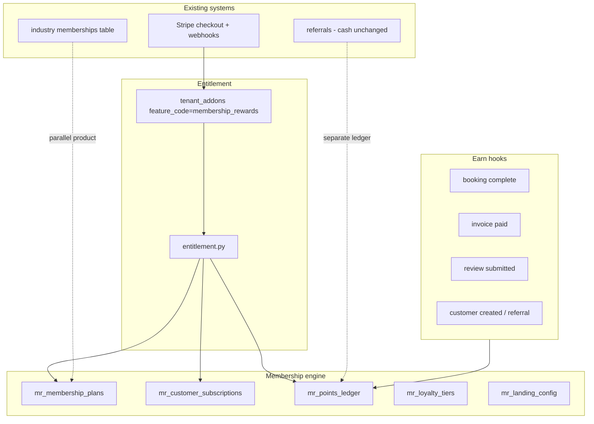

# Membership & Rewards — Final Implementation Report

**Project:** Customerflow GrowthApp  
**Module:** `membership_rewards` (add-on SKU)  
**Completed:** 2026-05-19 (Phases 1–8)  
**Analysis baseline:** [PHASE_1_REPORT.md](./PHASE_1_REPORT.md)  
**QA checklist:** [membership-rewards-phase8-qa.md](./membership-rewards-phase8-qa.md)

---

## 1. Executive summary

A **cross-niche Membership & Rewards** add-on was delivered as a new module extending existing Customerflow patterns (`tenant_addons`, CRM customers, booking, quotes/invoices, referrals, business site). It does **not** replace salon industry `memberships`, the referrals cash engine, or `TenantMember`.

| Decision | Implementation |
|----------|----------------|
| Plans | Parallel tenant-level `mr_membership_plans` |
| Public URL | `/p/{tenant}/memberships` |
| Points | Separate `mr_points_ledger` (not referral payouts) |
| Trial | 7 days on signup via `tenant_addons.expires_at` |
| Billing | Stripe Price `STRIPE_PRICE_MEMBERSHIP_REWARDS` on tenant SaaS customer |

---

## 2. Phases delivered

| Phase | Deliverable | Key artifacts |
|-------|-------------|---------------|
| **1** | Repo scan & gap analysis | `docs/PHASE_1_REPORT.md` |
| **2** | DB + backend foundations | `039_membership_rewards_core.py`, `modules/membership_rewards/` |
| **3** | API + earn hooks + checkout | `hooks.py`, Stripe webhook, `test_membership_rewards_phase3.py` |
| **4** | Dashboard UI | `MembershipRewardsDashboard.tsx`, sidebar, `/dashboard/membership-rewards` |
| **5** | Landing auto-generation | `landing.py`, public interest → leads, `test_membership_rewards_phase5.py` |
| **6** | Trial reminders | `reminders.py`, cron 09:15 & 18:15, trial banner/modal |
| **7** | Feature flags + Stripe polish | `/addons/status`, `billing.py`, revoke on cancel |
| **8** | QA + this report | `test_membership_rewards_integration.py`, phase8 QA doc |

---

## 3. Architecture



---

## 4. Database (migration `039`)

| Table | Purpose |
|-------|---------|
| `mr_tenant_settings` | Earn rules, landing slug, publish flag |
| `mr_membership_plans` | Tenant-level plans (price, cycle, rollover) |
| `mr_customer_subscriptions` | Customer ↔ plan enrollment |
| `mr_loyalty_tiers` | Bronze → Platinum thresholds |
| `mr_customer_loyalty` | Points balance + tier per customer |
| `mr_points_ledger` | Idempotent earn/spend/adjust entries |
| `mr_reward_catalog` / `mr_reward_redemptions` | Rewards shop |
| `mr_trial_reminders` | Trial email/modal/win-back timestamps |
| `mr_landing_config` | Generated landing JSON |

Reuses **`tenant_addons`** (from accounting migration `034`) with `feature_code = membership_rewards`.

---

## 5. API surface

**Prefix:** `/api/v1/membership-rewards`

| Endpoint | Auth | Notes |
|----------|------|-------|
| `GET /status` | Tenant | Trial/paid/billing flags |
| `GET /trial` | Tenant | Banner/modal state |
| `POST /checkout` | Owner | Stripe subscription for add-on |
| `POST /dev/grant` | Tenant | Non-production only |
| `GET /dashboard` | Entitled | Summary metrics |
| `GET|POST|PATCH /plans` | Entitled | Plan CRUD |
| `GET|POST /subscriptions` | Entitled | Customer enrollments |
| `GET /tiers`, `/catalog` | Entitled | Loyalty + rewards |
| `POST /points/adjust` | Entitled | Manual adjustment |
| `GET|PATCH /landing`, `POST .../publish` | Entitled | Landing editor |
| `GET /loyalty/leaderboard` | Entitled | Top customers |

**Public:** `GET /api/v1/public/memberships/{slug}`, `POST .../interest`

**Addons hub:** `GET /api/v1/addons/status` → `membership_rewards: bool`

**Admin:** `POST /api/v1/admin/tenants/{id}/addons/membership-rewards`

---

## 6. Points earn rules (idempotent)

Wired in:

- `booking/service.py` → booking completed
- `quotes_invoices/service.py` → invoice paid
- `reputation/service.py` → review submitted
- `crm/service.py` → customer created (referral path via hooks)

Default rules in `DEFAULT_EARN_RULES`; idempotency via `reference_type` + `reference_id` on ledger.

---

## 7. Trial & reminders

| Day | Channel | Purpose |
|-----|---------|---------|
| 3 | Email + notification | Setup check-in |
| 6 | Email + urgency modal | Last day warning |
| 15 | Email + win-back (50%) | Post-expiry offer |

Cron: **`membership_trial_reminders`** at 09:15 and 18:15 (worker).

Signup hook: `auth/service.py`, `signup_otp_service.py` → `on_tenant_signup` → 7-day `expires_at`.

---

## 8. Stripe billing

| Env var | Purpose |
|---------|---------|
| `STRIPE_PRICE_MEMBERSHIP_REWARDS` | Add-on subscription price ID |
| `STRIPE_SECRET_KEY` / `STRIPE_WEBHOOK_SECRET` | Checkout + webhooks |

**Flow:**

1. `POST /membership-rewards/checkout` → Stripe Checkout (metadata: `tenant_id`, `feature_code`)
2. Webhook `checkout.session.completed` → `activate_from_checkout_metadata` + subscription item ID
3. `customer.subscription.*` → `sync_addon_from_stripe_subscription` (active/trialing vs canceled/unpaid)

---

## 9. Frontend

| Route | Component |
|-------|-----------|
| `/dashboard/membership-rewards` | `MembershipRewardsDashboard` + gate |
| `/dashboard/membership-rewards/upgrade` | Stripe upgrade |
| `/p/[tenant]/memberships` | Public landing + `MembershipInterestForm` |
| `/dashboard/addons` | Hub card with active badge |

API client: `membershipRewards` in `apps/web/lib/api-client.ts`.

---

## 10. File map

```
apps/api/
  alembic/versions/039_membership_rewards_core.py
  app/modules/membership_rewards/
    constants.py, models.py, schemas.py
    entitlement.py, service.py, hooks.py
    landing.py, reminders.py, billing.py, router.py
  app/workers/tasks/membership_trial_reminders.py
  tests/test_membership_rewards*.py

apps/web/
  app/(dashboard)/dashboard/membership-rewards/
  app/p/[tenant]/memberships/page.tsx
  components/membership-rewards/
```

**Do not rename:** `referrals`, salon `memberships`, `TenantMember`, `tenant_addons`.

---

## 11. Test coverage

```bash
cd apps/api
python -m pytest tests/test_membership_rewards*.py -q
```

| File | Focus |
|------|--------|
| `test_membership_rewards.py` | Trial on signup, gating, public page |
| `test_membership_rewards_phase3.py` | Points, subscriptions |
| `test_membership_rewards_phase5.py` | Landing sync/publish |
| `test_membership_rewards_phase6.py` | Trial reminders |
| `test_membership_rewards_phase7.py` | Addons status, Stripe sync/revoke |
| `test_membership_rewards_integration.py` | E2E smoke |

---

## 12. Known limitations & follow-ups

1. **Customer membership payments** — Plans are recorded in-app; no Stripe billing per end-customer subscription yet.
2. **Industry salon memberships** — Still under `/addons/billing/memberships`; operators may run both products.
3. **Win-back discount** — Messaging only; coupon application in checkout not automated.
4. **Accounting Stripe sync** — Membership add-on sync added in worker; accounting uses separate checkout path (unchanged).

---

## 13. Production deploy

```bash
# API host
cd /path/to/GrowthApp/apps/api
alembic upgrade head

# Environment (API)
STRIPE_PRICE_MEMBERSHIP_REWARDS=price_xxxxxxxx
FRONTEND_URL=https://app.customerflow.ai

# Restart services
systemctl restart customerflow-api customerflow-worker
# Web rebuild if needed
```

Verify: new tenant signup → trial active → create plan → publish → public URL loads → optional Stripe upgrade.

---

## 14. References

- Phase 1 analysis: `docs/PHASE_1_REPORT.md`
- Phase 8 QA: `docs/membership-rewards-phase8-qa.md`
- Industry memberships (salon): `docs/industry-addons-architecture.md`
- Env template: `infra/.env.example` (`STRIPE_PRICE_MEMBERSHIP_REWARDS`)
