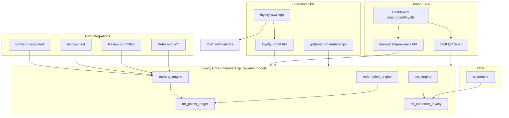

# PHASE 1 — Full Loyalty System Architecture Plan

**Date:** 2026-05-24  
**Mode:** Analysis & architecture only — **no implementation until approved**  
**Stack:** FastAPI + SQLAlchemy + Alembic (`apps/api`), Next.js App Router (`apps/web`) — **not Prisma/TypeScript backend**

---

## Executive summary

Your specification describes a **two-sided loyalty platform**:

1. **Tenant side** — configure rules, tiers, rewards, analytics, staff tools (mostly **already built** as `membership_rewards`).
2. **Customer side** — installable PWA wallet with login, points, redeem, QR, push (**largely missing**).

**Recommendation:** Evolve the existing `membership_rewards` module into the unified **Loyalty System** rather than creating a parallel `/modules/loyalty-system/` with duplicate tables. Map your spec tables to existing `mr_*` schema, add new tables only where gaps exist (customer auth, QR sessions, PWA push prefs).

**Do not rename:** `TenantMember`, salon `memberships`, `tenant_addons`, or `customers`.

---

## 1. Current state vs your spec

| Your spec area | Current implementation | Gap |
|----------------|------------------------|-----|
| Loyalty Engine (earn/redeem/tiers) | `apps/api/app/modules/membership_rewards/` | Extend; split `service.py` into focused engines |
| `loyalty_customers` | `customers` + `mr_customer_loyalty` | No separate table needed |
| `loyalty_points` | `mr_points_ledger` | Done |
| `loyalty_rewards` | `mr_reward_catalog` | Done |
| `loyalty_redemptions` | `mr_reward_redemptions` | Done |
| `loyalty_tiers` | `mr_loyalty_tiers` | Done |
| `loyalty_settings` | `mr_tenant_settings` | Done |
| `loyalty_trials` | `mr_trial_reminders` + `tenant_addons` | Done |
| Tenant dashboard `/dashboard/loyalty/*` | `/dashboard/membership-rewards` | Rename or alias routes; expand UI |
| Customer PWA `/apps/loyalty-pwa/` | **None** (tenant PWA only) | **New app** |
| Auto customer account + temp password | CRM customer on enroll/booking only | **New** customer auth layer |
| QR scan (staff + customer) | Refer QR in email/widget only | **New** QR token system |
| Billing 7-day trial + day 3/6/15 | Implemented in `reminders.py` + cron | Minor: unify messaging |
| Public loyalty landing | `/p/{tenant}/memberships` | Add `/loyalty` alias or merge |
| Points expiration job | `expires_at` on ledger; no sweep cron | **New** worker task |
| GDPR / customer data export | Partial (CRM) | Extend for loyalty PWA |

---

## 2. Repository map (relevant modules)

### 2.1 Authentication

| Layer | Path | Notes |
|-------|------|-------|
| Tenant JWT | `apps/api/app/core/security.py` | `sub`, `tid`, `role`, cookies |
| Tenant auth routes | `apps/api/app/modules/auth/` | login, register, OTP, magic link, 2FA |
| Tenant context | `apps/api/app/core/dependencies.py` | `CurrentTenantContext` |
| **Customer auth** | — | **Does not exist** — spec requires new module |

**Proposed customer auth:** `apps/api/app/modules/customer_portal/` or `membership_rewards/customer_auth.py`

- JWT type `customer_access` with `sub=customer_id`, `tid=tenant_id`
- Magic link + optional temp password on first booking/enrollment
- Separate cookie domain path or `Authorization` header for PWA

### 2.2 Tenant management & billing

| Path | Role |
|------|------|
| `apps/api/app/modules/tenants/models.py` | `tenants`, slug, plan |
| `apps/api/app/modules/accounting/models.py` | `tenant_addons` |
| `apps/api/app/modules/membership_rewards/billing.py` | Stripe add-on SKU |
| `apps/api/app/modules/membership_rewards/entitlement.py` | Feature gate |
| `apps/api/app/modules/addons/common/router.py` | `GET /addons/status` |

### 2.3 Bookings & CRM integration

| Path | Loyalty hook |
|------|--------------|
| `apps/api/app/modules/booking/service.py` | `on_booking_completed` → points |
| `apps/api/app/modules/booking/crm_link.py` | `resolve_customer_for_booking` |
| `apps/api/app/modules/booking/refer_win.py` | Refer & Win → points |
| `apps/api/app/modules/crm/models.py` | `customers`, `deals` |
| `apps/api/app/modules/quotes_invoices/service.py` | `on_invoice_paid` → points |
| `apps/api/app/modules/reputation/service.py` | `on_review_submitted` → points |

### 2.4 Notifications & email

| Path | Role |
|------|------|
| `apps/api/app/adapters/email/` | Resend / mock |
| `apps/api/app/workers/tasks/messaging.py` | `send_email_task` |
| `apps/api/app/modules/notifications/` | In-app notifications |
| `apps/api/app/modules/membership_rewards/reminders.py` | Trial emails |
| `apps/api/app/modules/membership_rewards/loyalty_email.py` | Welcome + bonus points |
| `apps/api/push_subscriptions` (migration 023) | Web push for **tenant** app |

### 2.5 Database ORM & migrations

- **ORM:** SQLAlchemy 2.x async — `apps/api/app/core/database.py`
- **Migrations:** Alembic — `apps/api/alembic/versions/` (head: `040_drop_referrals_system`)
- **Loyalty schema:** `039_membership_rewards_core.py` → 10 `mr_*` tables
- **No Prisma** — all spec `.ts` engine files map to Python modules

### 2.6 Frontend

| App | Path | Purpose |
|-----|------|---------|
| Tenant dashboard | `apps/web/app/(dashboard)/dashboard/` | Staff workspace |
| Membership & Rewards UI | `apps/web/app/(dashboard)/dashboard/membership-rewards/` | Loyalty admin (today) |
| Public memberships | `apps/web/app/p/[tenant]/memberships/` | Public landing |
| Public booking | `apps/web/app/book/[tenant_slug]/` | Widget |
| Tenant PWA | `apps/web/public/manifest.webmanifest` | `start_url: /dashboard` |
| **Customer loyalty PWA** | **To build:** `apps/loyalty-pwa/` | New Next.js or Vite app |

---

## 3. Proposed architecture — backend module layout

Extend **`apps/api/app/modules/membership_rewards/`** (feature code stays `membership_rewards`) with submodules matching your engine concept:

```
apps/api/app/modules/membership_rewards/
├── models.py                    # existing mr_* models
├── constants.py
├── schemas.py
├── router.py                    # tenant-authenticated API
├── customer_router.py           # NEW — customer JWT API (/loyalty-portal/*)
├── public_router.py             # NEW — move public enroll from public/router (optional)
│
├── engines/
│   ├── earning_engine.py        # earn_points, hooks, rule resolution
│   ├── redemption_engine.py     # redeem, stock, validation
│   ├── tier_engine.py           # tier calc, manual tier, upgrades
│   └── reward_rules.py          # earn_rules validation, defaults
│
├── services/
│   ├── customer_loyalty_service.py   # balance, history, profile
│   ├── tenant_loyalty_settings.py      # settings CRUD
│   ├── loyalty_billing.py              # existing billing.py
│   └── notification_triggers.py        # trial + tier + expiry + push
│
├── customer_auth/
│   ├── credentials.py           # temp password, magic link tokens
│   ├── provisioning.py          # auto-create on booking/enrollment
│   └── qr_tokens.py             # generate/validate scan tokens
│
├── landing.py                   # existing
├── reminders.py                 # existing trial cron
├── loyalty_email.py             # extend welcome + credentials email
└── hooks.py                     # existing event integrations
```

**Why not `loyalty-system/` with new tables:** Avoids duplicate ledgers, migration risk, and divergent billing. Your spec table names map 1:1 to `mr_*` (see §4).

---

## 4. Database — spec table mapping & new tables

### 4.1 Existing (reuse as-is)

| Spec table | Actual table | Notes |
|------------|--------------|-------|
| `loyalty_settings` | `mr_tenant_settings` | `earn_rules`, `points_expire_days`, `landing_published` |
| `loyalty_tiers` | `mr_loyalty_tiers` | Bronze–Platinum |
| `loyalty_points` | `mr_points_ledger` | Immutable ledger |
| `loyalty_rewards` | `mr_reward_catalog` | Points-cost catalog |
| `loyalty_redemptions` | `mr_reward_redemptions` | Fulfillment status |
| `loyalty_trials` | `mr_trial_reminders` | Day 3/6/15 timestamps |
| `loyalty_customers` | `customers` + `mr_customer_loyalty` | Composite, not denormalized |

### 4.2 New tables (migration `041_loyalty_customer_portal.py` — proposed)

| Table | Purpose |
|-------|---------|
| `mr_customer_credentials` | `customer_id`, `tenant_id`, `password_hash` (nullable), `must_change_password`, `last_login_at` |
| `mr_customer_magic_links` | One-time login tokens for PWA |
| `mr_customer_qr_tokens` | Rotating QR payload for in-store scan (`token`, `expires_at`, `customer_id`) |
| `mr_qr_scan_events` | Staff scan log (tenant_id, customer_id, staff_user_id, points_awarded?, scanned_at) |
| `mr_customer_push_subscriptions` | PWA push endpoints scoped to customer + tenant |

Optional later:

| Table | Purpose |
|-------|---------|
| `mr_loyalty_automations` | Rule-based emails (inactivity, tier upgrade) |

---

## 5. API surface (proposed)

### 5.1 Tenant API (extend existing `/api/v1/membership-rewards/`)

Already exists — add/complete:

| Endpoint | Status |
|----------|--------|
| `GET/POST/PATCH/DELETE /plans` | CRUD done |
| `GET/PATCH /tiers` | List + update done |
| `GET/PATCH /settings` | Done |
| `GET /loyalty/leaderboard` | Done |
| `POST /points/adjust` | Done |
| `GET /customers/{id}/loyalty` | Done — surface in CRM UI |
| `POST /customers/{id}/redeem/{item}` | API done — **wire dashboard UI** |
| `GET /analytics` | **New** — redemptions, top customers, expiring points |
| `POST /qr/scan` | **New** — staff validates customer QR |
| `GET /customers` loyalty filter | **New** — list with points/tier |

### 5.2 Customer portal API (new prefix `/api/v1/loyalty-portal/`)

| Method | Route | Purpose |
|--------|-------|---------|
| POST | `/auth/login` | Email + password (temp or permanent) |
| POST | `/auth/magic-link` | Request login link |
| POST | `/auth/magic-link/verify` | Exchange token for JWT |
| POST | `/auth/set-password` | First-login password change |
| GET | `/me` | Profile + tier + balance |
| GET | `/rewards` | Catalog (tenant-branded) |
| POST | `/rewards/{id}/redeem` | Redeem |
| GET | `/history` | Ledger paginated |
| GET | `/qr` | Current QR PNG/data URL |
| POST | `/push/subscribe` | Web push registration |

Tenant resolved from subdomain, `?tenant=slug`, or JWT `tid`.

### 5.3 Public API (existing + extend)

| Route | Status |
|-------|--------|
| `GET /public/memberships/{slug}` | Done |
| `POST .../loyalty-enroll` | Done (+ 200 signup bonus) |
| `POST .../interest` | Done |
| `GET /public/loyalty/{slug}/branding` | **New** — colors/logo for PWA |

---

## 6. Phase mapping — your spec → implementation plan

### PHASE 2 — Core modules

**Action:** Refactor `service.py` into `engines/` + `services/`; add `customer_auth/` and migration `041`. No duplicate tables.

**Deliverables:**
- Earning engine with idempotent reference keys (booking_id, invoice_id, loyalty_signup)
- Redemption engine with stock + fulfillment hooks
- Tier engine (preserve user-selected tier on enroll; upgrade-only recalc)
- Points expiration cron (`sweep_expired_loyalty_points_task`)

### PHASE 3 — Tenant dashboard

**Action:** Either rename route group to `/dashboard/loyalty/` (redirect from `membership-rewards`) or keep URL and expand sections.

| Your page | Maps to |
|-----------|---------|
| `index.tsx` | Overview (existing dashboard stats) |
| `settings.tsx` | Earn rules + enable/disable (exists in Loyalty section) |
| `rewards.tsx` | Catalog CRUD (exists — add redeem-fulfillment queue) |
| `tiers.tsx` | `LoyaltyTiersEditor` (exists) |
| `analytics.tsx` | **New** — charts, top customers, redemption rate |
| `customers.tsx` | **New** — searchable loyalty member list + manual adjust |

Also wire **CRM client detail** (`/dashboard/clients/[id]`) with inline loyalty panel.

### PHASE 4 — Customer PWA

**Action:** New monorepo app `apps/loyalty-pwa/` (Next.js 14 or Vite+React).

```
apps/loyalty-pwa/
├── public/manifest.webmanifest   # tenant-branded via runtime config
├── app/
│   ├── (auth)/login/
│   ├── dashboard/                # balance + tier
│   ├── rewards/
│   ├── history/
│   ├── profile/
│   └── qr/
├── components/
├── lib/api-client.ts             # loyalty-portal API
└── sw.js                         # offline shell + push
```

**Hosting:** `{tenant}.rewards.customerflow.ai` or `/rewards/{tenant}` on main domain.

**Requirements checklist:**
- Installable PWA — separate manifest per tenant (dynamic theme from API)
- Offline — cache last balance/history in IndexedDB
- Push — `mr_customer_push_subscriptions` + existing web push infra
- Dark/light — CSS variables from tenant branding API

### PHASE 5 — Auto account creation

**Trigger points:**
1. First **booking** with email → `provisioning.ensure_customer_portal_account()`
2. **Loyalty tier modal** submit → same + welcome email already partial
3. Optional **booking widget** checkbox “Join rewards program”

**Email contents:**
- Temporary password (or magic link only — preferred for security)
- Link to PWA: `https://{domain}/rewards/{tenant_slug}`
- QR code for wallet page
- Signup bonus points (200 default — already implemented for enroll)

**New files:** `customer_auth/provisioning.py`, extend `loyalty_email.py`

### PHASE 6 — QR + scan system

| Actor | Flow |
|-------|------|
| Customer PWA | `/qr` shows rotating token QR (5–15 min TTL) |
| Staff dashboard | `/dashboard/loyalty/scan` — camera/scanner input → `POST /membership-rewards/qr/scan` |
| API | Validate token → log event → optional earn rule (e.g. visit check-in points) |

Reuse `segno` QR generation pattern from `tenants/site_service.py`.

### PHASE 7 — Billing + trial

**Already implemented** — verify only:

| Rule | Implementation |
|------|----------------|
| 7-day trial | `on_tenant_signup` → `tenant_addons` + `mr_trial_reminders` |
| Day 3 email + in-app | `reminders.py` + cron 09:15/18:15 |
| Day 6 final reminder | Same |
| Expiry → disable | Entitlement check on `tenant_addons.expires_at` |
| Day 15 winback 50% | `reminders.py` + upgrade URL |

**Gap:** Ensure loyalty features hard-stop when trial expired (gate public enroll + hooks).

### PHASE 8 — Landing page auto-generation

**Current:** `/p/{tenant}/memberships` auto-sync from plans.

**Spec asks:** `/public/{tenantId}/loyalty/` — recommend:
- Keep canonical URL `/p/{tenant}/memberships`
- Add redirect `/p/{tenant}/loyalty` → same page
- Embed QR + “Download Rewards App” CTA on page
- Show on booking widget + leads page via link/QR cards (widget page partially done)

### PHASE 9 — Testing & QA

| Area | Approach |
|------|----------|
| Unit tests | Engine modules (`earning_engine`, `redemption_engine`, `tier_engine`) |
| Integration | Customer auth flow, enroll → points → leaderboard, QR scan |
| PWA | Playwright mobile viewports; Lighthouse PWA audit |
| Migrations | Alembic up/down on Postgres test DB |
| Email | Mock adapter assertions |
| Billing | Trial day simulation (existing phase 6 tests pattern) |
| GDPR | Export customer loyalty data endpoint; delete cascades on customer soft-delete |

---

## 7. Architecture diagram



---

## 8. Conflicts & decisions (need your approval)

| # | Decision | Recommendation |
|---|----------|----------------|
| 1 | New `loyalty-system` module vs extend `membership_rewards` | **Extend** — avoid duplicate schema |
| 2 | Dashboard URL `/dashboard/loyalty` vs `/membership-rewards` | **Alias both** — redirect old URL |
| 3 | Customer PWA separate app vs route in `apps/web` | **Separate app** `apps/loyalty-pwa` — cleaner PWA manifest & auth |
| 4 | Temp password vs magic-link-only for customers | **Magic link primary**, optional password set on first visit |
| 5 | New table names vs keep `mr_*` prefix | **Keep `mr_*`** — map spec conceptually in docs |
| 6 | Salon industry `memberships` table | **Keep parallel** — no bridge unless you require unified billing |
| 7 | Public URL `/p/{tenant}/loyalty` vs `/memberships` | **Both** — loyalty redirects to memberships |
| 8 | Points expiration | **Add cron** — required for enterprise completeness |

---

## 9. Effort estimate (phases 2–9)

| Phase | Relative effort | Depends on |
|-------|-----------------|------------|
| 2 Core refactor + new tables | Medium | Approval of module structure |
| 3 Tenant dashboard expansion | Medium | Phase 2 |
| 4 Customer PWA | **Large** | Phase 2 customer auth API |
| 5 Auto provisioning | Medium | Phase 4 + email templates |
| 6 QR scan | Medium | Phase 4 + staff UI |
| 7 Billing/trial hardening | Small | Mostly done |
| 8 Landing aliases + embeds | Small | Mostly done |
| 9 QA | Medium | All phases |

**Suggested implementation order:** 2 → 7 (harden) → 3 → 5 → 4 → 6 → 8 → 9

---

## 10. What NOT to build (out of scope unless you say otherwise)

- Replacing salon `memberships` / industry billing
- Customer Stripe subscriptions for MR plans (Connect) — schema has `stripe_subscription_id` but no flow
- Full rollover/proration billing engine — schema only today
- Rewriting tenant PWA — keep separate customer PWA

---

## 11. Approval checklist

Before Phase 2 coding begins, please confirm:

- [ ] Extend `membership_rewards` rather than new `loyalty-system` module
- [ ] Keep `mr_*` table prefix; add only customer portal tables in migration 041
- [ ] New app at `apps/loyalty-pwa/` for customer PWA
- [ ] Customer auth: magic link primary (+ optional password)
- [ ] Dashboard route strategy: `/dashboard/loyalty` with redirect from `/membership-rewards`
- [ ] Public URL: `/p/{tenant}/loyalty` alias to `/memberships`
- [ ] Implementation order (§9) acceptable

---

**Status:** Phase 1 complete — awaiting approval to proceed to Phase 2.
