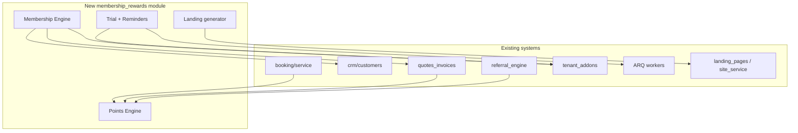

# PHASE 1 — Membership & Rewards System — Repo Scan & Gap Analysis

**Date:** 2026-05-19  
**Scope:** Full Customerflow monorepo (`apps/api`, `apps/web`, `docs`, workers, billing, addons)  
**Mode:** Analysis only — **no implementation code** in this phase.

---

## Executive summary

Customerflow already has **strong foundations** for a paid add-on model (`tenant_addons`), a **full referral stack**, **salon-only customer memberships** under industry billing, **landing/business-site generation**, and **multiple trial/reminder paths** that overlap but are not unified.

A production **Membership & Rewards** add-on must be built as a **new vertical module** (recommended: `apps/api/app/modules/membership_rewards/`) that **extends** existing patterns without renaming `TenantMember`, `memberships` (salon table), or `referrals`.

**Conflicts detected:** naming collisions and duplicate trial schedules (see §5).  
**No conflicts** on greenfield table names if the new module uses a distinct prefix (e.g. `mr_` tables or `membership_rewards_*` feature code).

---

## 1. Existing components found

### 1.1 Paid add-on / entitlement pattern (extend for feature flags)

| Path | What it does |
|------|----------------|
| `apps/api/app/modules/accounting/models.py` | `TenantAddon` table, `FEATURE_ACCOUNTING` |
| `apps/api/app/modules/accounting/entitlement.py` | `tenant_has_accounting`, `require_accounting` |
| `apps/api/app/modules/addons/common/constants.py` | `industry_booking`, `industry_billing`, `industry_crm` |
| `apps/api/app/modules/addons/common/entitlement.py` | `tenant_has_addon`, `require_addon` |
| `apps/api/app/modules/addons/common/service.py` | `grant_addon` / `revoke_addon` |
| `apps/api/app/modules/addons/common/router.py` | `GET /addons/status`, dev grant |
| `apps/api/alembic/versions/034_accounting_addon.py` | Creates `tenant_addons` |
| `apps/web/components/addons/AddonGate.tsx` | UI gate from `/addons/status` |
| `apps/web/components/addons/AddonUpgradeScreen.tsx` | Upgrade CTA |
| `apps/web/app/(dashboard)/dashboard/addons/**` | Industry add-on hub |
| `apps/web/components/addons/IndustryAddonsUpgradeAlert.tsx` | Banner when no industry SKUs |

**Pattern to mirror:** New feature code e.g. `membership_rewards` on `tenant_addons`, plus `entitlement.py` + `require_membership_rewards` + web `AddonGate` variant or shared gate with feature prop.

---

### 1.2 Customer memberships (partial — salon industry only)

| Path | What it does |
|------|----------------|
| `apps/api/app/modules/addons/industry_models.py` | `Membership`, `MembershipBenefit`, `IndustryServicePackage`, `PackageRedemption` |
| `apps/api/app/modules/addons/billing/service.py` | `create_membership`, `list_memberships`, packages, tips |
| `apps/api/app/modules/addons/billing/router.py` | `POST/GET /addons/billing/memberships` (gated by `industry_billing`) |
| `apps/api/alembic/versions/036_industry_salon_garage.py` | DB tables `memberships`, `membership_benefits` |
| `apps/web/components/addons/IndustryAddonWorkspace.tsx` | Dev-style list/create memberships |
| `docs/industry-addons-architecture.md` | Salon memberships spec; realtor items deferred |

**Current `Membership` fields:** `customer_id`, `name`, `status`, `price_pence`, `billing_interval`, `stripe_subscription_id`, `started_at`, `ends_at`, benefits JSON.

**Gap:** Vertical-gated (`industry_billing` + salon), not a cross-niche **Membership Engine** with plan catalog, rollover, proration, usage tracking, or tenant-facing admin.

---

### 1.3 Referral engine (largely complete — extend, do not replace)

| Path | What it does |
|------|----------------|
| `apps/api/app/modules/referrals/` | models, service, router, schemas |
| `apps/api/app/services/referrals/referral_engine.py` | Hooks: signup, booking, invoice, subscription |
| `apps/api/app/api/admin/referrals.py` | Admin approval |
| `apps/api/app/modules/booking/refer_win.py` | Public Refer & Win → CRM lead |
| `apps/api/alembic/versions/008_referrals.py` | Postgres-only migration |
| `apps/web/app/(dashboard)/dashboard/referrals/**` | Tenant + client UI |
| `apps/web/app/(marketing)/r/[code]/page.tsx` | Public ref landing |
| `apps/web/app/book/[tenant_slug]/refer/page.tsx` | Booking widget refer |

**CRM linkage:** `customers.reward_amount`, `reward_type`, `reward_delivery_method` (migration `033_booking_widget_forms.py`).

**Spec fit:** Referral **codes, links, signup/booking rewards** — mostly present. **Points-based referral rewards** and unified **reward ledger** — missing.

---

### 1.4 Reward points / loyalty / tiers (missing as product)

| Finding | Notes |
|---------|--------|
| No `loyalty` or `points_ledger` module | — |
| `crm_score_rules.points` | Lead **scoring**, not customer loyalty (`crm/pipeline_models.py`) |
| Marketing copy only | `apps/web/app/(marketing)/page.tsx` mentions loyalty |
| Freelancer **pricing tiers** | `billing/freelancer_self_router.py` — unrelated |
| Lead marketplace `min_subscription_level` | Platform tier gating, not customer Bronze/Silver/Gold |

---

### 1.5 Trial logic (fragmented — must unify for 7-day add-on trial)

| Path | What it does |
|------|----------------|
| `apps/api/app/core/config.py` | `TRIAL_LEAD_DAYS=7`, `TRIAL_LEADS_PER_DAY=2` |
| `apps/api/app/modules/lead_marketplace/trial_assignment.py` | 2 leads/day for first 7 days after signup |
| `apps/api/app/workers/tasks/trial_leads.py` | Cron: assign leads + **day-6** `trial_auto_leads_ending` email |
| `apps/api/app/modules/tenants/models.py` | `trial_ends_at`, `trial_reminder_sent_at` |
| `apps/api/app/workers/tasks/email_sequences.py` | Onboarding days **3, 7, 10**; trial expiry **12–13** (14-day assumption) |
| `apps/api/app/templates/emails/onboarding_reminder.html` | Day 3/7/10 content |
| `apps/api/app/templates/emails/trial_expiry.html` | SaaS trial ending |
| `apps/api/app/templates/emails/trial_auto_leads_ending.html` | Lead trial day 6 |
| `apps/api/app/modules/auth/service.py` | Welcome email mentions **14-day** trial |
| `apps/web/app/(dashboard)/dashboard/leads/page.tsx` | Trial banner for **lead** trial |

**Critical:** `send_onboarding_emails` / `email_sequences` tasks exist but are **not registered** in `apps/api/app/workers/worker_settings.py` → likely never run in production.

**Spec vs reality:**

| Spec | Current |
|------|---------|
| Day 3 reminder | Implemented in `email_sequences` (not cron’d); onboarding template exists |
| Day 6 (1 day before trial ends) | **Lead trial** day-6 email only (`trial_leads.py`) |
| Day 15 win-back 50% | **Not found** |
| 7-day free trial for **membership add-on** | **Not found** — separate from lead trial |

---

### 1.6 Landing pages & auto-generated tenant sites (extend for `/memberships`)

| Path | What it does |
|------|----------------|
| `apps/api/app/modules/landing_pages/` | CRUD, sections JSON, publish |
| `apps/api/app/modules/tenants/site_service.py` | Bootstrap from templates, subdomain publish |
| `apps/api/app/modules/marketing/seed.py` | Template `beauty-spa-membership` (marketing only) |
| `apps/web/app/p/[tenant]/[slug]/page.tsx` | Public landing render |
| `apps/web/app/(public)/[tenantSlug]/page.tsx` | Public business site |
| `apps/web/app/(dashboard)/dashboard/site-builder/page.tsx` | Site wizard |
| `docs/business-site-notes.md` | Subdomain + publish flow |

**Gap:** No dedicated **`/memberships`** (or booking/leads fallback) route auto-provisioned per tenant for membership/rewards CTA.

---

### 1.7 Billing & automations (integration points)

| Path | What it does |
|------|----------------|
| `apps/api/app/modules/billing/` | SaaS `SubscriptionPlan`, Stripe tenant subscription |
| `apps/api/app/modules/quotes_invoices/` | Customer invoices, recurrency renewal reminders |
| `apps/api/app/modules/automation/` | Event-driven automations |
| `apps/api/app/workers/worker_settings.py` | ARQ cron registry |
| `apps/api/app/workers/tasks/industry.py` | Rebook reminders |
| `apps/api/app/modules/booking/enterprise/automation.py` | Booking notification queue |

---

### 1.8 In-app notifications / modals

| Path | What it does |
|------|----------------|
| `apps/api/app/modules/notifications/` (if present) | To be wired in Phase 2 — grep shows task notifications in CRM enterprise |
| `apps/web/components/addons/IndustryAddonsUpgradeAlert.tsx` | Pattern for in-app upgrade alerts |

*Phase 2 should confirm `apps/api/app/modules/notifications` or equivalent for in-app modal triggers.*

---

### 1.9 Module visibility (sidebar — not SKU flags)

| Path | What it does |
|------|----------------|
| `apps/api/app/modules/admin/tool_config.py` | Per-tenant tool paths |
| `apps/web/components/layout/Sidebar.tsx` | Nav items |

---

## 2. Missing components (vs strict feature list)

| Feature (spec) | Status |
|----------------|--------|
| **Membership Engine** (plans, cycles, included services, discounts, rollover, cancel, prorate, recurring billing, usage) | **Missing** as unified product; partial salon `memberships` table only |
| **Reward Points Engine** (earn, redeem, items, logs, tiers, expiration) | **Missing** |
| **Referral Engine** (full spec) | **~70% present**; extend for points + membership hooks |
| **Automations** (trial, rewards, tiers, win-back, inactivity) | **Partial**; no membership-specific automations |
| **7-day free trial** for membership add-on | **Missing** (lead trial ≠ add-on trial) |
| **Reminder schedule** Day 3 / 6 / 15 (email + in-app) | **Partial / wrong schedule**; Day 15 missing |
| **Auto landing page** `/memberships` per tenant | **Missing** (templates exist, not wired) |
| **In-app UI** (Membership dashboard, Rewards dashboard, tier badges, redeem/upgrade modals, trial widget) | **Missing** |
| **Backend** dedicated migrations for rewards/tiers/trial state | **Missing** (except salon `memberships`) |
| **`membership_rewards_addon_enabled` flag** | **Missing** (use new `tenant_addons.feature_code`) |
| **QA tests** for membership/rewards | **Missing** |

---

## 3. Files requiring extension (do not rename)

### Backend

| File / area | Extension |
|-------------|-----------|
| `apps/api/app/modules/addons/common/constants.py` | Add `FEATURE_MEMBERSHIP_REWARDS` |
| `apps/api/app/modules/addons/common/entitlement.py` | Reuse `tenant_has_addon` with new code |
| `apps/api/app/modules/accounting/models.py` | Reuse `TenantAddon` model (no rename) |
| `apps/api/app/services/referrals/referral_engine.py` | Hook point events → points earn |
| `apps/api/app/modules/booking/service.py` | Booking completed → points |
| `apps/api/app/modules/quotes_invoices/service.py` | Purchase → points |
| `apps/api/app/modules/tenants/site_service.py` | Publish membership landing section |
| `apps/api/app/modules/landing_pages/service.py` | New template slug `membership-rewards` |
| `apps/api/app/modules/tenants/models.py` | Optional: set `trial_ends_at` on onboarding for add-on trial |
| `apps/api/app/workers/worker_settings.py` | Register new cron: trial reminders + win-back |
| `apps/api/app/main.py` | `include_router` new module |
| `apps/api/alembic/env.py` | Import new models |

### Optional merge with salon memberships (Phase 2 decision)

| File | Note |
|------|------|
| `apps/api/app/modules/addons/industry_models.py` | **Do not rename** `Membership` class/table. Either bridge salon memberships into new engine or keep parallel with clear docs. |

### Frontend

| File / area | Extension |
|-------------|-----------|
| `apps/web/lib/api-client.ts` | New `membershipRewards` client |
| `apps/web/components/layout/Sidebar.tsx` | Nav when entitled |
| `apps/web/components/addons/AddonGate.tsx` | Support `membership_rewards` feature |
| `apps/web/app/(dashboard)/dashboard/addons/page.tsx` | Card for new add-on |
| New routes under `apps/web/app/(dashboard)/dashboard/membership-rewards/` | Dashboards |
| New public route e.g. `apps/web/app/book/[tenant_slug]/memberships/page.tsx` | Landing |

---

## 4. Conflicts detected

| Issue | Severity | Mitigation |
|-------|----------|------------|
| **`membership` naming:** `TenantMember` vs `memberships` (salon) vs `segments` membership | Medium | New module namespace `membership_rewards`; UI labels "Membership & Rewards" |
| **`trial` naming:** 7-day lead trial vs 14-day email copy vs Stripe `trialing` | High | Single source: `tenant_addons` trial for SKU + `trial_ends_at` |
| **`reward` naming:** referral payouts vs CRM `reward_*` vs future points | Medium | Points in `mr_points_ledger`; keep referral tables unchanged |
| **`email_sequences` not in cron** | High | Phase 6: register cron OR merge into new worker |
| **Day 6 duplicate risk** | Medium | `trial_leads` day-6 vs spec day-6 for add-on trial — separate flags per program |
| **Migration `008_referrals` Postgres-only** | Low (dev) | Document SQLite limitation; use Postgres in CI |
| **Doc drift:** `037_industry_billing` in docs vs `037_invoice_payment_channel` in repo | Low | Update docs in Phase 8 |

**No conflicts detected** for adding new tables with prefix `membership_reward_*` or feature code `membership_rewards`.

---

## 5. Recommended module layout (Phase 2+ — additive only)

```
apps/api/app/modules/membership_rewards/
  __init__.py
  models.py              # plans, subscriptions, points_ledger, tiers, trial_state, landing_config
  schemas.py
  service.py             # membership CRUD, points earn/redeem, tier logic
  router.py              # /membership-rewards/*
  entitlement.py         # wraps tenant_addons feature_code
  trial.py               # 7-day trial start/expiry
  reminders.py           # day 3, 6, 15 sweeps
  landing.py             # public landing payload
  hooks.py               # booking, invoice, referral, review hooks

apps/api/app/workers/tasks/membership_rewards.py

apps/api/alembic/versions/039_membership_rewards_core.py

apps/web/app/(dashboard)/dashboard/membership-rewards/
apps/web/app/book/[tenant_slug]/memberships/   # or /p/[tenant]/memberships
apps/web/components/membership-rewards/
```

**Do NOT rename:** `referrals`, `addons/billing/memberships`, `TenantMember`, `tenant_addons`.

---

## 6. Phase-wise readiness checklist

| Phase | Ready? | Notes |
|-------|--------|-------|
| **Phase 2** DB + services | Yes | Clear extension points; new migration `039+` |
| **Phase 3** API | Yes | Follow `addons/common/router.py` + `accounting/router.py` patterns |
| **Phase 4** Frontend | Yes | Reuse `AddonGate`, `ModuleCardGrid`, brand tokens |
| **Phase 5** Landing | Yes | Extend `site_service` + `landing_pages` |
| **Phase 6** Reminders | Needs design | Unify trial clock; wire cron; add day 15 + in-app |
| **Phase 7** Feature flags | Yes | `tenant_addons` + `require_addon` |
| **Phase 8** QA | Yes | Follow `test_addons_entitlement.py` pattern |

---

## 7. Integration map (booking, CRM, billing, automations)



---

## 8. Decisions required before Phase 2 (product)

1. **Salon `memberships` table:** Bridge into new engine vs keep industry-only and build parallel tenant-level plans?
2. **Trial scope:** 7-day trial for **membership_rewards add-on SKU** only, or replace global SaaS trial messaging?
3. **Landing URL:** Prefer `/book/{slug}/memberships`, `/p/{tenant}/memberships`, or subdomain path on business site?
4. **Points vs referral cash:** Referral rewards stay in `referrals` module; points are separate ledger (recommended).
5. **Stripe:** Recurring membership billing via existing tenant Stripe customer or new Connect flow?

---

## 9. Conclusion

| Item | Result |
|------|--------|
| **Existing components found** | Add-on entitlements, referrals, salon memberships, landing sites, fragmented trial/reminders |
| **Missing components** | Points engine, tiers, unified membership engine, add-on trial, day-15 win-back, dedicated UI & landing route |
| **Files requiring extension** | Listed in §3 — extend only |
| **Conflicts** | Naming + trial schedule overlap — manageable with new module prefix and explicit trial type |
| **No code written** | Phase 1 complete |

**Next step:** Phase 2 — database migrations and backend foundations per approved decisions in §8.

---

*Generated for Cursor strict-mode implementation. Do not rename existing symbols.*
